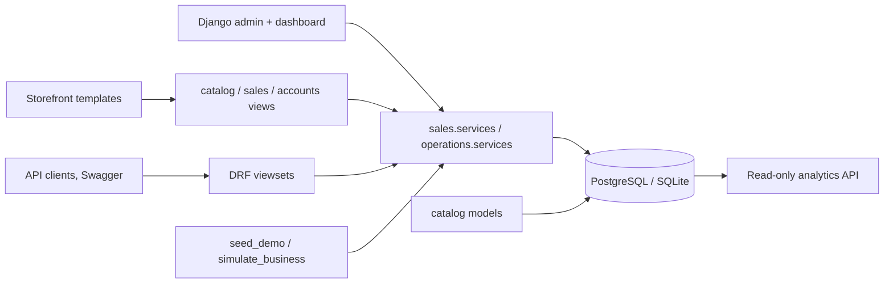

# Architecture

CommerceLab is a Django 4.2 modular monolith. Server-rendered storefront views and DRF API views both delegate
stock and order behaviour to transaction-aware service functions in `sales/services.py` and
`operations/services.py`; nothing outside those modules mutates stock or order status.

## Modules

| App | Owns |
|---|---|
| `accounts` | `CustomerProfile`, `AuditLog`, registration/profile views, user admin with profile inline |
| `catalog` | `Category`, `Brand`, `Product` (+ `ProductQuerySet.storefront()`), `ProductVariant`, `ProductImage`, `PriceHistory`, `Review`, `Wishlist`; storefront views (home, catalog, product page); REST API; admin; `pre_save` signal that records price changes |
| `sales` | `Discount`, `Cart` (customer or guest), `CartItem`, `Order` (shipping snapshot, access token), `OrderItem` (per-warehouse line), `OrderHistory`, `Payment` (gateway, last4), `ReturnRequest`; `services.py` (cart helpers, guest users, allocation, checkout, transitions, charge/webhook, expiry); `payments.py` (gateway abstraction); `tasks.py` (Celery jobs); cart/checkout/order/webhook views; REST API; admin with lifecycle actions |
| `operations` | `Warehouse`, `Inventory`, `InventoryMovement`, `Supplier`, `SupplierProduct`, `PurchaseOrder`, `Transfer`, `Campaign`, `ProductEvent`; `services.py` (reserve / release / ship / receive with `select_for_update`) |
| `analytics` | read-only aggregations (`/api/analytics/*`) and the management commands `seed_demo`, `simulate_business`, `simulate_scenario` |
| `config` | settings, URL routing, `CommerceLabAdminSite` (KPI dashboard on the admin index) |

## Request flow for a purchase

1. `catalog.storefront_views.product_detail` renders variants with `available_quantity`.
2. `sales.storefront_views.cart_add` → `services.add_to_cart` validates visibility, activity and stock.
3. `checkout` view → `services.checkout` (guests get a password-less customer record) → `services.allocate`
   chooses a warehouse per line (single warehouse when possible, split otherwise), reserves stock
   (`operations.services.reserve`), snapshots prices/costs/tax and warehouse into `OrderItem`, stores the shipping
   address, increments discount usage and deactivates the cart.
4. `order_pay` → `services.charge` asks the gateway from `sales/payments.py` to charge the card, records a
   `Payment` and, on success, `transition(order, "PAID")` (which queues the confirmation e-mail task). Asynchronous
   providers call `/payments/webhook/<gateway>/` → `services.confirm_payment`.
5. Staff move the order through `PROCESSING → PACKED → SHIPPED → DELIVERED` in the admin (or via
   `POST /api/sales/orders/{id}/transition/`). `SHIPPED` deducts physical stock; `CANCELLED` releases reservations.

## Single sources of truth

- Storefront visibility: `Product.objects.storefront()` (`active=True AND status=ACTIVE`) — used by the
  storefront, the public API and the admin dashboard.
- Availability: `physical - reserved` summed over active variants and all warehouses.
- Totals: `services.cart_totals()` is used by the cart page, checkout page and the `checkout()` service.

## Runtime

PostgreSQL is the production-like database (Docker Compose); SQLite is the local fallback. Static files are
served by WhiteNoise; uploaded product images are stored under `MEDIA_ROOT`. Background jobs are Celery tasks in
`sales/tasks.py` (`expire_unpaid_orders` every 15 min, `cleanup_abandoned_carts` daily, `send_order_confirmation`
on payment); without `CELERY_BROKER_URL` they execute inline, with it the Compose `worker` and `beat` services
run them on Redis.
